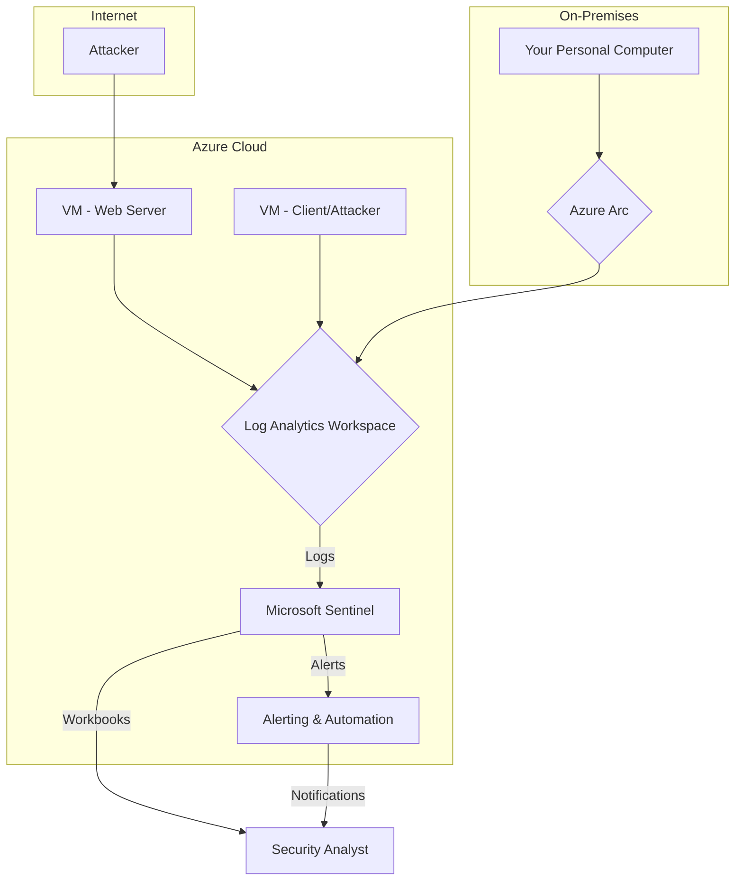

# SIEM-analys-with-Microsoft-Sentinel ( Will Updating to 8/5/2025 ) 
SIEM Implementation with Microsoft Sentinel (Azure Cloud)

## Mục đích của Dự án

Dự án này nhằm mục đích xây dựng và triển khai một hệ thống Security Information and Event Management (SIEM) cơ bản sử dụng Microsoft Sentinel trên nền tảng Azure. Mục tiêu chính là:

*   **Thu thập log tập trung:** Thu thập và tổng hợp các log bảo mật từ nhiều nguồn khác nhau, bao gồm máy ảo trên Azure (máy chủ web, máy khách/tấn công) và máy tính cá nhân (on-premises) vào một không gian làm việc Log Analytics duy nhất.
*   **Giám sát và phát hiện mối đe dọa:** Thiết lập các quy tắc phân tích (Analytic Rules) trong Microsoft Sentinel để tự động phát hiện các hoạt động đáng ngờ và các cuộc tấn công bảo mật (ví dụ: SQL Injection, quét cổng, tấn công brute-force RDP).
*   **Mô phỏng và phân tích phản ứng:** Thực hiện các cuộc tấn công mô phỏng trong môi trường được kiểm soát để kiểm tra khả năng phát hiện của SIEM, phân tích các cảnh báo và sự cố (Incidents), từ đó hiểu rõ hơn về cách hệ thống phản ứng với các mối đe dọa thực tế.
*   **Nâng cao kỹ năng thực tế:** Cung cấp kinh nghiệm thực hành về quản lý tài nguyên Azure, cấu hình SIEM, phân tích log bảo mật và ứng phó sự cố, rất phù hợp cho những người mới bắt đầu trong lĩnh vực an ninh mạng.

## Kiến trúc Hệ thống

Kiến trúc tổng thể của dự án được thiết kế để thu thập và phân tích log từ các nguồn khác nhau, với Microsoft Sentinel là trung tâm xử lý và giám sát.

**Mô tả các thành phần chính:**

*   **VM - Web Server:** Máy ảo Windows Server chạy IIS, PHP, MySQL và ứng dụng web dễ bị tấn công (DVWA) để mô phỏng các cuộc tấn công web.
*   **VM - Client/Attacker:** Máy ảo Linux (Ubuntu) được cài đặt các công cụ tấn công như Nmap, Sqlmap, Hydra để thực hiện các kịch bản tấn công mô phỏng.
*   **Your Personal Computer (On-Premises):** Máy tính cá nhân của bạn, được kết nối với Azure thông qua Azure Arc để thu thập log bảo mật từ môi trường on-premises.
*   **Log Analytics Workspace:** Dịch vụ Azure để thu thập, lưu trữ và phân tích log từ tất cả các nguồn dữ liệu.
*   **Microsoft Sentinel:** Dịch vụ SIEM và SOAR (Security Orchestration, Automation, and Response) trên Azure, sử dụng dữ liệu từ Log Analytics Workspace để phát hiện, điều tra và phản ứng với các mối đe dọa.
*   **Alerting & Automation:** Các quy tắc cảnh báo và Playbooks (Logic Apps) trong Sentinel để tự động thông báo và thực hiện các hành động phản ứng khi phát hiện mối đe dọa.
*   **Workbooks:** Các dashboard tương tác trong Sentinel để trực quan hóa dữ liệu và cung cấp cái nhìn tổng quan về tình hình bảo mật.

## Các Kịch bản Tấn công Mô phỏng

Dự án này bao gồm việc mô phỏng và phát hiện các loại tấn công sau:

1.  **SQL Injection:** Sử dụng `sqlmap` để tấn công ứng dụng web DVWA trên `VM - Web Server`.
2.  **Port Scanning:** Sử dụng `nmap` để quét các cổng trên `VM - Web Server`.
3.  **RDP Brute-force:** Sử dụng `hydra` để thực hiện tấn công brute-force vào dịch vụ RDP trên `VM - Web Server`.

## Hướng dẫn Triển khai và Cấu hình

Để triển khai dự án này, bạn sẽ cần thực hiện các bước chính sau:

1.  **Chuẩn bị môi trường Azure:** Tạo Resource Group, Virtual Network và các Subnet cần thiết.
2.  **Triển khai và cấu hình Máy ảo:**
    *   Tạo `VM - Web Server` (Windows Server) và cài đặt IIS, PHP, MySQL, DVWA.
    *   Tạo `VM - Client/Attacker` (Linux) và cài đặt các công cụ tấn công.
3.  **Cấu hình Microsoft Sentinel:**
    *   Tạo và kích hoạt Microsoft Sentinel trên Log Analytics Workspace.
    *   Cấu hình các Data Connector để thu thập log từ `VM - Web Server` (Windows Security Events, IIS logs), `VM - Client/Attacker` (Syslog hoặc Windows Security Events), và máy tính cá nhân (qua Azure Arc).
4.  **Thiết lập Analytic Rules:** Tạo các quy tắc phát hiện dựa trên KQL cho các kịch bản tấn công đã nêu.
5.  **Thực hiện mô phỏng tấn công:** Chạy các công cụ tấn công từ `VM - Client/Attacker` và quan sát phản ứng trong Sentinel.
6.  **Phân tích và phản ứng:** Điều tra các Incidents được tạo ra, phân tích log và thực hiện các hành động phản ứng cần thiết.

## Tối ưu hóa Chi phí

Để quản lý chi phí hiệu quả trong quá trình thực hiện dự án (đặc biệt với tài khoản dùng thử Azure), hãy lưu ý:

*   Sử dụng các loại máy ảo có chi phí thấp (ví dụ: B-series).
*   Cân nhắc sử dụng Azure Spot Instances cho các VM không yêu cầu tính sẵn sàng cao (ví dụ: `VM - Client/Attacker`).
*   Luôn cấu hình tự động tắt máy (Auto-shutdown) cho các VM.
*   `Deallocate` (dừng và giải phóng tài nguyên) các VM khi không sử dụng.
*   Xóa toàn bộ Resource Group sau khi hoàn thành dự án.

## Liên kết Hữu ích

*   [Microsoft Sentinel Documentation](https://docs.microsoft.com/en-us/azure/sentinel/)
*   [Azure Virtual Machines Documentation](https://docs.microsoft.com/en-us/azure/virtual-machines/)
*   [Azure Arc Documentation](https://docs.microsoft.com/en-us/azure/azure-arc/)
*   [DVWA GitHub Repository](https://github.com/digininja/DVWA)

---

